# 🗄️ ErlassGudangApp — Dokumentasi Database (v3.5)

Dokumen ini menjelaskan struktur database, skema tabel, tipe data, relasi antar-entitas, serta aturan bisnis data pada sistem **ErlassGudangApp**, mencakup gudang reguler, unit asset terserialisasi, dan modul lapangan **MIKMS** (Micro:bit Interactive Kit Management System).

---

## 1. Arsitektur Database & Spesifikasi

- **DBMS**: MySQL / MariaDB (versi 8.0+)
- **Nama Database**: `gudangscan_db`
- **Engine**: InnoDB (mendukung *Foreign Keys* dan *Database Transactions* / ACID)
- **Collation**: `utf8mb4_unicode_ci` (mendukung penuh karakter multibyte)

---

## 2. Diagram Relasi Entitas (ERD)

```mermaid
erDiagram
    users {
        int id PK
        string name
        string email "nullable"
        string password
        string pin "nullable, unique"
        string nik "nullable, unique"
        string role "admin | petugas"
        timestamp created_at
        timestamp updated_at
    }
    categories {
        int id PK
        string nama
        int parent_id FK "nullable, self-ref"
        timestamp created_at
        timestamp updated_at
    }
    items {
        int id PK
        int category_id FK "nullable"
        string kode "unique"
        string nama
        string satuan
        string jenis_barang "INV | SVC"
        string upc_barcode "nullable"
        string produk
        string komponen
        string lokasi_default
        int min_stok
        text deskripsi
        boolean is_active
        timestamp deleted_at "SoftDeletes"
        timestamp created_at
        timestamp updated_at
    }
    locations {
        int id PK
        int parent_id FK "nullable, self-ref"
        string nama
        string tipe "gedung|lantai|ruangan|rak"
        string kode "unique"
        timestamp created_at
        timestamp updated_at
    }
    vendors {
        int id PK
        string nama
        string kontak
        string telepon
        string alamat
        timestamp created_at
        timestamp updated_at
    }
    customers {
        int id PK
        string nama
        string kontak
        string telepon
        string alamat
        timestamp created_at
        timestamp updated_at
    }
    assets {
        int id PK
        int item_id FK
        int location_id FK "nullable"
        string serial_number "unique"
        enum tipe_kepemilikan "normal|sewa|bekas"
        enum status "good|not_good|lengkap|tidak_lengkap"
        boolean is_rented
        timestamp created_at
        timestamp updated_at
    }
    transactions {
        int id PK
        int user_id FK "nullable"
        int item_id FK
        int asset_id FK "nullable"
        int vendor_id FK "nullable"
        int customer_id FK "nullable"
        int location_id FK "nullable"
        string client_id "nullable, unique"
        enum tipe "masuk | keluar"
        enum tipe_detail "pembelian|sewa_keluar|sewa_kembali|mutasi_lokasi|pembuangan"
        int qty
        date transaction_date
        string lokasi "legacy field"
        string sumber
        string penerima
        string keperluan
        string no_dokumen
        string no_po
        string no_prn
        string job_number
        string transfer_order
        string petugas
        text catatan
        timestamp created_at
        timestamp updated_at
    }

    mikms_modules {
        int id PK
        string code "unique"
        string name
        text description
        timestamp created_at
        timestamp updated_at
    }
    mikms_bom {
        int id PK
        int module_id FK
        int item_id FK
        string box_category
        int quantity
        string notes
        timestamp created_at
        timestamp updated_at
    }
    mikms_boxes {
        int id PK
        string box_code "unique"
        string category
        string program_code
        string status "READY|ON_LOAN|REPAIR|DAMAGED"
        text notes
        timestamp created_at
        timestamp updated_at
    }
    mikms_productions {
        int id PK
        date production_date
        int module_id FK
        int quantity_produced
        string produced_by
        text notes
        timestamp created_at
        timestamp updated_at
    }
    mikms_qc_logs {
        int id PK
        date qc_date
        int module_id FK
        string target_box_code
        string status_qc "LOLOS|TIDAK LOLOS"
        text defect_notes
        string checked_by
        text notes
        timestamp created_at
        timestamp updated_at
    }
    mikms_shipments {
        int id PK
        date shipment_date
        string box_code
        string program_code
        string program_name
        string school_name
        int quantity_box
        string shipped_by
        string received_by_school
        text notes
        timestamp created_at
        timestamp updated_at
    }
    mikms_returns {
        int id PK
        date return_date
        string box_code
        string school_name
        string condition "LENGKAP|RUSAK|HILANG"
        string problematic_item_code
        string problematic_item_name
        int problematic_quantity
        string received_by
        text notes
        timestamp created_at
        timestamp updated_at
    }
    mikms_repairs {
        int id PK
        date repair_date
        string item_code
        string item_name
        string asset_id
        string damage_type
        string repair_action
        int quantity
        string repair_result "BERHASIL|GAGAL"
        string repaired_by
        text notes
        timestamp created_at
        timestamp updated_at
    }
    mikms_stock_opnames {
        int id PK
        date opname_date
        string item_code
        string item_name
        int system_quantity
        int physical_quantity
        int difference
        string difference_reason
        string counted_by
        timestamp created_at
        timestamp updated_at
    }
    mikms_module_stocks {
        int id PK
        int module_id FK "unique"
        int stock_ready
        timestamp created_at
        timestamp updated_at
    }
    mikms_module_stock_logs {
        int id PK
        int module_id FK
        string type "production_in|package_out|manual_adjust|return_in"
        int quantity
        int stock_before
        int stock_after
        string reference_type
        int reference_id
        string performed_by
        text notes
        timestamp created_at
        timestamp updated_at
    }
    mikms_package_orders {
        int id PK
        date order_date
        string program_code
        string program_name
        int package_qty
        int customer_id FK "nullable"
        string customer_name
        string status "COMPLETED|PENDING|CANCELLED"
        json deduction_log
        string ordered_by
        text notes
        timestamp created_at
        timestamp updated_at
    }

    users ||--o{ transactions : "menginput"
    categories ||--o{ items : "mengelompokkan"
    categories ||--o{ categories : "parent"
    items ||--o{ transactions : "memiliki mutasi"
    items ||--o{ assets : "memiliki unit"
    items ||--o{ mikms_bom : "komponen modul"
    locations ||--o{ assets : "menampung"
    locations ||--o{ transactions : "dicatat di"
    locations ||--o{ locations : "parent"
    vendors ||--o{ transactions : "sumber"
    customers ||--o{ transactions : "penerima sewa"
    customers ||--o{ mikms_package_orders : "pemesan paket"
    assets ||--o{ transactions : "riwayat"
    mikms_modules ||--o{ mikms_bom : "memiliki komponen"
    mikms_modules ||--o{ mikms_productions : "diproduksi"
    mikms_modules ||--o{ mikms_qc_logs : "diperiksa"
    mikms_modules ||--o{ mikms_module_stocks : "stok jadi"
    mikms_modules ||--o{ mikms_module_stock_logs : "mutasi stok jadi"
```

---

## 3. Detail Skema Tabel

### 3.1 Tabel `users`
Menyimpan data akun pengguna sistem untuk autentikasi API.

| Nama Kolom | Tipe Data | Nullable | Keterangan |
|---|---|---|---|
| `id` | bigint unsigned | No | Primary Key (Auto Increment) |
| `name` | varchar(255) | No | Nama lengkap pengguna |
| `email` | varchar(255) | Yes | Alamat email (opsional, nullable) |
| `password` | varchar(255) | No | Password akun (terenkripsi Hash bcrypt) |
| `pin` | varchar(6) | Yes | PIN 6-digit untuk login cepat lapangan |
| `nik` | varchar(50) | Yes | NIK Karyawan unik untuk login |
| `role` | varchar(50) | No | Hak akses: `admin` atau `petugas` |
| `created_at` | timestamp | Yes | Tanggal data dibuat |
| `updated_at` | timestamp | Yes | Tanggal data diperbarui |

### 3.2 Tabel `categories`
Master kategori barang secara hierarkis (Parent / Sub-kategori).

| Nama Kolom | Tipe Data | Nullable | Keterangan |
|---|---|---|---|
| `id` | bigint unsigned | No | Primary Key |
| `nama` | varchar(255) | No | Nama kategori barang |
| `parent_id` | bigint unsigned | Yes | FK ke `categories.id` (null = Kategori Utama) |
| `created_at` | timestamp | Yes | Timestamp dibuat |
| `updated_at` | timestamp | Yes | Timestamp diperbarui |

### 3.3 Tabel `items`
Master seluruh barang dan jasa inventaris (mendukung SoftDeletes).

| Nama Kolom | Tipe Data | Nullable | Keterangan |
|---|---|---|---|
| `id` | bigint unsigned | No | Primary Key |
| `category_id` | bigint unsigned | Yes | FK ke `categories.id` |
| `kode` | varchar(255) | No | Kode unik barang / barcode (misal: `CT-001`) |
| `nama` | varchar(255) | No | Nama lengkap barang |
| `satuan` | varchar(50) | No | Satuan kemasan (pcs, unit, set, roll) |
| `jenis_barang` | enum('INV','SVC') | No | Jenis: `INV` (Inventory Fisik), `SVC` (Jasa) |
| `upc_barcode` | varchar(100) | Yes | Barcode pabrik eksternal |
| `produk` | varchar(255) | Yes | Kategori produk |
| `komponen` | varchar(255) | Yes | Sub-kategori komponen |
| `lokasi_default` | varchar(255) | Yes | Lokasi default gudang |
| `min_stok` | int | No | Batas minimum sebelum warning (default: 5) |
| `deskripsi` | text | Yes | Keterangan detail barang |
| `is_active` | tinyint(1) | No | Status aktif (default: 1) |
| `deleted_at` | timestamp | Yes | Timestamp soft-delete |
| `created_at` | timestamp | Yes | Timestamp dibuat |
| `updated_at` | timestamp | Yes | Timestamp diperbarui |

### 3.4 Tabel `locations`
Hierarki lokasi fisik penempatan barang (`gedung` → `lantai` → `ruangan` → `rak`).

| Nama Kolom | Tipe Data | Nullable | Keterangan |
|---|---|---|---|
| `id` | bigint unsigned | No | Primary Key |
| `parent_id` | bigint unsigned | Yes | FK ke `locations.id` |
| `nama` | varchar(255) | No | Nama lokasi (misal: "Rak A-1") |
| `tipe` | enum | No | `gedung`, `lantai`, `ruangan`, `rak` |
| `kode` | varchar(100) | No | Kode unik lokasi |
| `created_at` | timestamp | Yes | Timestamp dibuat |
| `updated_at` | timestamp | Yes | Timestamp diperbarui |

### 3.5 Tabel `vendors`
Master pemasok / supplier bahan mentah dan barang.

| Nama Kolom | Tipe Data | Nullable | Keterangan |
|---|---|---|---|
| `id` | bigint unsigned | No | Primary Key |
| `nama` | varchar(255) | No | Nama vendor/supplier |
| `kontak` | varchar(255) | Yes | PIC / Nama kontak person |
| `telepon` | varchar(50) | Yes | Nomor telepon |
| `alamat` | text | Yes | Alamat lengkap vendor |
| `created_at` | timestamp | Yes | Timestamp dibuat |
| `updated_at` | timestamp | Yes | Timestamp diperbarui |

### 3.6 Tabel `customers`
Master pelanggan / sekolah klien penerima kit dan peminjam alat.

| Nama Kolom | Tipe Data | Nullable | Keterangan |
|---|---|---|---|
| `id` | bigint unsigned | No | Primary Key |
| `nama` | varchar(255) | No | Nama customer / sekolah |
| `kontak` | varchar(255) | Yes | PIC sekolah |
| `telepon` | varchar(50) | Yes | Nomor telepon |
| `alamat` | text | Yes | Alamat sekolah |
| `created_at` | timestamp | Yes | Timestamp dibuat |
| `updated_at` | timestamp | Yes | Timestamp diperbarui |

### 3.7 Tabel `assets`
Unit barang fisik terserialisasi (Serial Number individual) untuk sewa dan pelacakan unit.

| Nama Kolom | Tipe Data | Nullable | Keterangan |
|---|---|---|---|
| `id` | bigint unsigned | No | Primary Key |
| `item_id` | bigint unsigned | No | FK ke `items.id` |
| `location_id` | bigint unsigned | Yes | FK ke `locations.id` |
| `serial_number` | varchar(255) | No | Serial number unik per unit |
| `tipe_kepemilikan` | enum | No | `normal`, `sewa`, `bekas` |
| `status` | enum | No | `good`, `not_good`, `lengkap`, `tidak_lengkap` |
| `is_rented` | tinyint(1) | No | Flag sedang disewa keluar (1/0) |
| `created_at` | timestamp | Yes | Timestamp dibuat |
| `updated_at` | timestamp | Yes | Timestamp diperbarui |

### 3.8 Tabel `transactions`
Catatan mutasi stok umum dan audit trail pergerakan asset.

| Nama Kolom | Tipe Data | Nullable | Keterangan |
|---|---|---|---|
| `id` | bigint unsigned | No | Primary Key |
| `user_id` | bigint unsigned | Yes | FK ke `users.id` (penginput) |
| `item_id` | bigint unsigned | No | FK ke `items.id` |
| `asset_id` | bigint unsigned | Yes | FK ke `assets.id` (khusus unit sewa) |
| `vendor_id` | bigint unsigned | Yes | FK ke `vendors.id` |
| `customer_id` | bigint unsigned | Yes | FK ke `customers.id` |
| `location_id` | bigint unsigned | Yes | FK ke `locations.id` |
| `client_id` | varchar(255) | Yes | Unique UUID offline sync |
| `tipe` | enum('masuk','keluar') | No | Jenis mutasi |
| `tipe_detail` | enum | Yes | `pembelian`, `sewa_keluar`, `sewa_kembali`, `mutasi_lokasi`, `pembuangan` |
| `qty` | int unsigned | No | Kuantitas mutasi |
| `transaction_date` | date | No | Tanggal transaksi |
| `lokasi` | varchar(255) | Yes | Legacy field nama gudang |
| `sumber` | varchar(255) | Yes | Asal barang (tipe masuk) |
| `penerima` | varchar(255) | Yes | Penerima barang (tipe keluar) |
| `keperluan` | varchar(255) | Yes | Tujuan pengeluaran |
| `no_dokumen` | varchar(255) | Yes | Nomor surat jalan |
| `no_po` | varchar(255) | Yes | Nomor Purchase Order |
| `no_prn` | varchar(255) | Yes | Nomor PRN |
| `job_number` | varchar(255) | Yes | Nomor Job |
| `transfer_order` | varchar(255) | Yes | Nomor TO |
| `petugas` | varchar(255) | Yes | Nama PIC |
| `catatan` | text | Yes | Catatan transaksi |
| `created_at` | timestamp | Yes | Timestamp dibuat |
| `updated_at` | timestamp | Yes | Timestamp diperbarui |

---

### Modul Lapangan MIKMS (Micro:bit Suite)

### 3.9 Tabel `mikms_modules`
Master modul kit rakitan Micro:bit (M01-M10).

| Nama Kolom | Tipe Data | Nullable | Keterangan |
|---|---|---|---|
| `id` | bigint unsigned | No | Primary Key |
| `code` | varchar(20) | No | Kode modul unik (misal: `M01`, `M02`) |
| `name` | varchar(100) | No | Nama modul (misal: "Controller Kit") |
| `description` | text | Yes | Deskripsi fungsi modul |
| `created_at` | timestamp | Yes | Timestamp dibuat |
| `updated_at` | timestamp | Yes | Timestamp diperbarui |

### 3.10 Tabel `mikms_bom`
Bill of Materials yang merinci kebutuhan komponen mentah (`items`) untuk setiap modul.

| Nama Kolom | Tipe Data | Nullable | Keterangan |
|---|---|---|---|
| `id` | bigint unsigned | No | Primary Key |
| `module_id` | bigint unsigned | No | FK ke `mikms_modules.id` (onDelete: cascade) |
| `item_id` | bigint unsigned | No | FK ke `items.id` (onDelete: cascade) |
| `box_category` | varchar(100) | Yes | Kategori boks (misal: "BOX 1 – Beginner Kit") |
| `quantity` | int | No | Jumlah komponen yang dibutuhkan per modul |
| `notes` | varchar(255) | Yes | Catatan spesifikasi komponen |
| `created_at` | timestamp | Yes | Timestamp dibuat |
| `updated_at` | timestamp | Yes | Timestamp diperbarui |

### 3.11 Tabel `mikms_boxes`
Master unit boks kit fisik yang beredar di lapangan dan gudang.

| Nama Kolom | Tipe Data | Nullable | Keterangan |
|---|---|---|---|
| `id` | bigint unsigned | No | Primary Key |
| `box_code` | varchar(50) | No | Kode barcode boks unik (misal: `BOX-MLK-001`) |
| `category` | varchar(100) | No | Kategori boks (BOX 1 Beginner, BOX 2 Supporting, dll) |
| `program_code` | varchar(50) | Yes | Kode program paket (MLK, ROBOTIC) |
| `status` | varchar(30) | No | `READY`, `ON_LOAN`, `REPAIR`, `DAMAGED`, `DISPOSED` |
| `notes` | text | Yes | Keterangan kelengkapan boks |
| `created_at` | timestamp | Yes | Timestamp dibuat |
| `updated_at` | timestamp | Yes | Timestamp diperbarui |

### 3.12 Tabel `mikms_productions`
Catatan perakitan modul dari komponen mentah.

| Nama Kolom | Tipe Data | Nullable | Keterangan |
|---|---|---|---|
| `id` | bigint unsigned | No | Primary Key |
| `production_date` | date | No | Tanggal perakitan |
| `module_id` | bigint unsigned | No | FK ke `mikms_modules.id` |
| `quantity_produced` | int | No | Jumlah unit modul yang selesai dirakit |
| `produced_by` | varchar(100) | No | Nama teknisi/petugas perakit |
| `notes` | text | Yes | Catatan batch produksi |
| `created_at` | timestamp | Yes | Timestamp dibuat |
| `updated_at` | timestamp | Yes | Timestamp diperbarui |

### 3.13 Tabel `mikms_qc_logs`
Catatan hasil pengujian kelayakan dan kendali mutu modul sebelum masuk boks.

| Nama Kolom | Tipe Data | Nullable | Keterangan |
|---|---|---|---|
| `id` | bigint unsigned | No | Primary Key |
| `qc_date` | date | No | Tanggal QC |
| `module_id` | bigint unsigned | No | FK ke `mikms_modules.id` |
| `target_box_code` | varchar(50) | Yes | Kode boks tujuan pengemasan |
| `status_qc` | varchar(30) | No | `LOLOS` atau `TIDAK LOLOS` |
| `defect_notes` | text | Yes | Rincian cacat jika tidak lolos |
| `checked_by` | varchar(100) | No | Nama petugas pemeriksa |
| `notes` | text | Yes | Catatan QC |
| `created_at` | timestamp | Yes | Timestamp dibuat |
| `updated_at` | timestamp | Yes | Timestamp diperbarui |

### 3.14 Tabel `mikms_shipments`
Surat jalan pengiriman boks kit ke sekolah / mitra.

| Nama Kolom | Tipe Data | Nullable | Keterangan |
|---|---|---|---|
| `id` | bigint unsigned | No | Primary Key |
| `shipment_date` | date | No | Tanggal kirim |
| `box_code` | varchar(50) | No | Kode boks yang dikirimkan |
| `program_code` | varchar(50) | Yes | Program paket (MLK/ROBOTIC) |
| `program_name` | varchar(100) | Yes | Nama program lengkap |
| `school_name` | varchar(150) | No | Nama sekolah penerima |
| `quantity_box` | int | No | Jumlah boks (default: 1) |
| `shipped_by` | varchar(100) | No | Nama pengirim / kurir |
| `received_by_school` | varchar(100) | Yes | Nama guru/PIC penerima di sekolah |
| `notes` | text | Yes | Catatan pengiriman |
| `created_at` | timestamp | Yes | Timestamp dibuat |
| `updated_at` | timestamp | Yes | Timestamp diperbarui |

### 3.15 Tabel `mikms_returns`
Catatan pengembalian boks kit dari sekolah beserta kondisi fisik barang.

| Nama Kolom | Tipe Data | Nullable | Keterangan |
|---|---|---|---|
| `id` | bigint unsigned | No | Primary Key |
| `return_date` | date | No | Tanggal diterima kembali |
| `box_code` | varchar(50) | No | Kode boks |
| `school_name` | varchar(150) | No | Nama sekolah asal pengembalian |
| `condition` | varchar(30) | No | `LENGKAP`, `RUSAK`, `HILANG` |
| `problematic_item_code` | varchar(50) | Yes | Kode item yang rusak/hilang |
| `problematic_item_name` | varchar(150) | Yes | Nama item yang rusak/hilang |
| `problematic_quantity` | int | No | Jumlah item yang rusak/hilang |
| `received_by` | varchar(100) | No | Nama petugas gudang penerima |
| `notes` | text | Yes | Keterangan kendala retur |
| `created_at` | timestamp | Yes | Timestamp dibuat |
| `updated_at` | timestamp | Yes | Timestamp diperbarui |

### 3.16 Tabel `mikms_repairs`
Catatan penanganan reparasi komponen modul atau boks kit bermasalah.

| Nama Kolom | Tipe Data | Nullable | Keterangan |
|---|---|---|---|
| `id` | bigint unsigned | No | Primary Key |
| `repair_date` | date | No | Tanggal perbaikan |
| `item_code` | varchar(50) | No | Kode barang yang diperbaiki |
| `item_name` | varchar(150) | No | Nama barang |
| `asset_id` | varchar(50) | Yes | Kode boks kit terkait |
| `damage_type` | varchar(150) | No | Jenis kerusakan |
| `repair_action` | varchar(255) | No | Tindakan teknis perbaikan |
| `quantity` | int | No | Jumlah unit yang diperbaiki |
| `repair_result` | varchar(30) | No | `BERHASIL` atau `GAGAL` |
| `repaired_by` | varchar(100) | No | Nama teknisi |
| `notes` | text | Yes | Catatan pengujian pasca repair |
| `created_at` | timestamp | Yes | Timestamp dibuat |
| `updated_at` | timestamp | Yes | Timestamp diperbarui |

### 3.17 Tabel `mikms_stock_opnames`
Pencatatan pemeriksaan fisik inventaris lapangan vs data sistem.

| Nama Kolom | Tipe Data | Nullable | Keterangan |
|---|---|---|---|
| `id` | bigint unsigned | No | Primary Key |
| `opname_date` | date | No | Tanggal opname |
| `item_code` | varchar(50) | No | Kode barang |
| `item_name` | varchar(150) | No | Nama barang |
| `system_quantity` | int | No | Saldo tercatat pada sistem |
| `physical_quantity` | int | No | Hasil hitung fisik di gudang |
| `difference` | int | No | Selisih (Fisik - Sistem) |
| `difference_reason` | varchar(255) | Yes | Alasan selisih jika ada |
| `counted_by` | varchar(100) | No | Nama auditor / pencatat |
| `created_at` | timestamp | Yes | Timestamp dibuat |
| `updated_at` | timestamp | Yes | Timestamp diperbarui |

### 3.18 Tabel `mikms_module_stocks`
Saldo stok modul rakitan jadi (M01-M10) yang siap pakai di rak.

| Nama Kolom | Tipe Data | Nullable | Keterangan |
|---|---|---|---|
| `id` | bigint unsigned | No | Primary Key |
| `module_id` | bigint unsigned | No | FK ke `mikms_modules.id` (Unique) |
| `stock_ready` | int | No | Kuantitas modul jadi yang siap pakai |
| `created_at` | timestamp | Yes | Timestamp dibuat |
| `updated_at` | timestamp | Yes | Timestamp diperbarui |

### 3.19 Tabel `mikms_module_stock_logs`
Audit trail seluruh mutasi masuk dan keluar pada stok modul jadi.

| Nama Kolom | Tipe Data | Nullable | Keterangan |
|---|---|---|---|
| `id` | bigint unsigned | No | Primary Key |
| `module_id` | bigint unsigned | No | FK ke `mikms_modules.id` |
| `type` | varchar(30) | No | `production_in`, `package_out`, `manual_adjust`, `return_in` |
| `quantity` | int | No | Jumlah mutasi (+ masuk, - keluar) |
| `stock_before` | int | No | Saldo stok sebelum mutasi |
| `stock_after` | int | No | Saldo stok setelah mutasi |
| `reference_type` | varchar(50) | Yes | Referensi tabel (`mikms_package_orders`, `manual`) |
| `reference_id` | bigint unsigned | Yes | ID entitas referensi |
| `performed_by` | varchar(100) | Yes | PIC pelaksana |
| `notes` | text | Yes | Keterangan mutasi |
| `created_at` | timestamp | Yes | Timestamp dibuat |
| `updated_at` | timestamp | Yes | Timestamp diperbarui |

### 3.20 Tabel `mikms_package_orders`
Data pesanan paket kit bertingkat (*Cascading BOM*) lengkap dengan log deduksi bertingkat format JSON.

| Nama Kolom | Tipe Data | Nullable | Keterangan |
|---|---|---|---|
| `id` | bigint unsigned | No | Primary Key |
| `order_date` | date | No | Tanggal pesanan |
| `program_code` | varchar(50) | No | Kode program (misal: `MLK`, `ROBOTIC`) |
| `program_name` | varchar(100) | Yes | Nama program paket |
| `package_qty` | int | No | Jumlah paket yang dipesan |
| `customer_id` | bigint unsigned | Yes | FK ke `customers.id` (onDelete: set null) |
| `customer_name` | varchar(150) | Yes | Nama pemesan / sekolah |
| `status` | varchar(30) | No | `COMPLETED`, `PENDING`, `CANCELLED` |
| `deduction_log` | json | Yes | Rincian lengkap pembagian modul rak vs rakitan mentah |
| `ordered_by` | varchar(100) | No | Nama petugas pemroses |
| `notes` | text | Yes | Catatan pesanan |
| `created_at` | timestamp | Yes | Timestamp dibuat |
| `updated_at` | timestamp | Yes | Timestamp diperbarui |

---

## 4. Logika Data Dinamis & Aturan Bisnis

1. **Kalkulasi Total Stok Reguler**:
   Nilai stok fisik barang mentah dihitung dinamis dari selisih transaksi masuk dan keluar pada tabel `transactions`:
   $$\text{Stok} = \sum (\text{Qty Masuk}) - \sum (\text{Qty Keluar})$$

2. **Dua Tingkat Deduksi Stok (Cascading BOM)**:
   - **Tingkat 1**: Mengurangi `mikms_module_stocks.stock_ready` untuk modul yang sudah tersedia di rak.
   - **Tingkat 2**: Untuk modul yang kurang, sistem secara otomatis merakit langsung dari bahan baku mentah dengan mencatat pengeluaran stok di `transactions` dan riwayat auto-produksi di `mikms_productions`.

3. **Lifecycle Status Boks Kit (`mikms_boxes.status`)**:
   - `READY`: Siap dikirim ke sekolah / digunakan.
   - `ON_LOAN`: Sedang dipinjam/digunakan di sekolah (pemicu: `POST /mikms/shipments`).
   - `REPAIR`: Mengalami kerusakan saat retur (pemicu: `POST /mikms/returns` kondisi RUSAK).
   - `DAMAGED` / `DISPOSED`: Rusak berat / tidak dapat diperbaiki.
   - Pemulihan kembali ke `READY` dipicu jika tindakan perbaikan di `POST /mikms/repairs` tercatat `BERHASIL`.

---

## 5. Kebijakan Relasi & Integritas Data (Foreign Keys)

| Relasi Parent → Child | Kebijakan `onDelete` | Deskripsi Integritas |
|:---|:---|:---|
| `items` → `transactions` | **CASCADE** | Jika master item dihapus permanen, mutasi transaksinya ikut terhapus |
| `items` → `assets` | **CASCADE** | Unit terserialisasi terkait ikut terhapus |
| `items` → `mikms_bom` | **CASCADE** | Item komponen di BOM terhapus otomatis |
| `mikms_modules` → `mikms_bom` | **CASCADE** | Menghapus modul menghapus seluruh baris BOM komponennya |
| `mikms_modules` → `mikms_productions` | **CASCADE** | Menghapus modul menghapus riwayat produksinya |
| `mikms_modules` → `mikms_qc_logs` | **CASCADE** | Menghapus modul menghapus riwayat QC-nya |
| `mikms_modules` → `mikms_module_stocks` | **CASCADE** | Saldo modul jadi terhapus otomatis |
| `categories` → `items` | **SET NULL** | Menghapus kategori menyisakan item tanpa kategori |
| `categories` → `categories` (self) | **SET NULL** | Menghapus parent mengubah sub-kategori menjadi Kategori Utama |
| `locations` → `assets` | **SET NULL** | Menghapus lokasi meniadakan data lokasi pada unit asset |
| `customers` → `mikms_package_orders` | **SET NULL** | Menghapus data customer mempertahankan riwayat pesanan paket |
