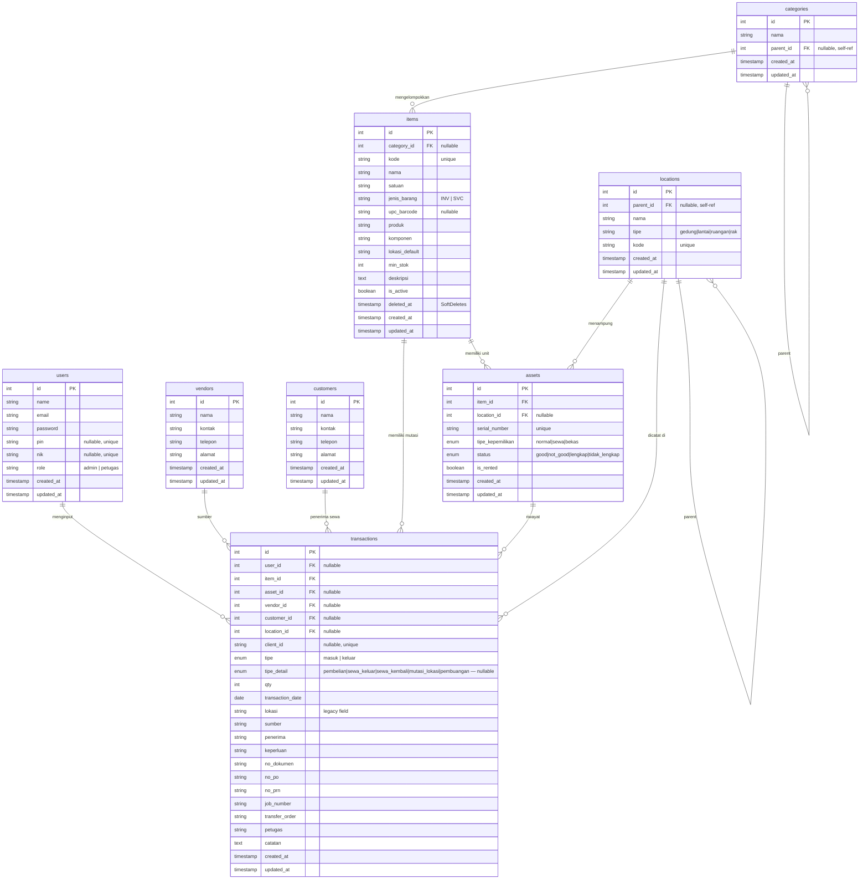

# 🗄️ ErlassGudangApp — Dokumentasi Database

Dokumen ini menjelaskan struktur database, skema tabel, tipe data, relasi antar-entitas, serta aturan bisnis data pada sistem **ErlassGudangApp**.

---

## 1. Arsitektur Database & Spesifikasi

- **DBMS**: MySQL / MariaDB (minimal versi 5.7+ atau 8.0+)
- **Nama Database**: `gudangscan_db`
- **Engine**: InnoDB (mendukung *Foreign Keys* dan *Database Transactions* / ACID)
- **Collation**: `utf8mb4_unicode_ci` (mendukung penuh karakter multibyte)

---

## 2. Diagram Relasi Entitas (ERD)

---

## 3. Detail Skema Tabel

### 3.1 Tabel `users`
Menyimpan akun pengguna terdaftar untuk akses autentikasi API.

| Nama Kolom | Tipe Data | Nullable | Keterangan |
|---|---|---|---|
| `id` | bigint unsigned | No | Primary Key (Auto Increment) |
| `name` | varchar(255) | No | Nama lengkap pengguna |
| `email` | varchar(255) | No | Alamat email unik |
| `password` | varchar(255) | No | Password akun (terenkripsi Hash) |
| `pin` | varchar(6) | Yes | Legacy PIN 6-digit unik |
| `nik` | varchar(50) | Yes | NIK Karyawan unik untuk login |
| `role` | varchar(50) | No | Hak akses: `admin` atau `petugas` |
| `created_at` | timestamp | Yes | Tanggal & waktu data dibuat |
| `updated_at` | timestamp | Yes | Tanggal & waktu data diperbarui |

### 3.2 Tabel `categories`
Menyimpan master kategori barang secara hierarkis (Sub Kategori dari).

| Nama Kolom | Tipe Data | Nullable | Keterangan |
|---|---|---|---|
| `id` | bigint unsigned | No | Primary Key (Auto Increment) |
| `nama` | varchar(255) | No | Nama kategori |
| `parent_id` | bigint unsigned | Yes | FK ke `categories.id` (null = Kategori Utama) |
| `created_at` | timestamp | Yes | Tanggal & waktu data dibuat |
| `updated_at` | timestamp | Yes | Tanggal & waktu data diperbarui |

### 3.3 Tabel `items`
Menyimpan data master barang/inventaris (Barang & Jasa). Mendukung **SoftDeletes**.

| Nama Kolom | Tipe Data | Nullable | Keterangan |
|---|---|---|---|
| `id` | bigint unsigned | No | Primary Key (Auto Increment) |
| `category_id` | bigint unsigned | Yes | FK ke `categories.id` (Kategori Barang) |
| `kode` | varchar(255) | No | Kode QR/Barcode unik barang (misal: `MSJ01`) |
| `nama` | varchar(255) | No | Nama lengkap barang |
| `satuan` | varchar(50) | No | Satuan kemasan (pcs, unit, set, box, lembar) |
| `jenis_barang` | enum('INV', 'SVC') | No | Jenis: `INV` (Inventory/Barang Fisik), `SVC` (Service/Jasa) |
| `upc_barcode` | varchar(100) | Yes | Barcode UPC/EAN eksternal pabrik |
| `produk` | varchar(255) | Yes | Legacy/Backup produk group (misal: `Modul`) |
| `komponen` | varchar(255) | Yes | Sub-kategori komponen |
| `lokasi_default` | varchar(255) | Yes | Lokasi gudang penempatan default |
| `min_stok` | int | No | Batas minimum stok sebelum memicu peringatan (default: 5) |
| `deskripsi` | text | Yes | Keterangan tambahan barang |
| `is_active` | tinyint(1) | No | Status aktif data barang (default: 1) |
| `deleted_at` | timestamp | Yes | Timestamp soft-delete |
| `created_at` | timestamp | Yes | Tanggal & waktu data dibuat |
| `updated_at` | timestamp | Yes | Tanggal & waktu data diperbarui |

### 3.4 Tabel `locations`
Menyimpan hierarki lokasi fisik gudang (gedung → lantai → ruangan → rak). Mendukung **self-referential parent**.

| Nama Kolom | Tipe Data | Nullable | Keterangan |
|---|---|---|---|
| `id` | bigint unsigned | No | Primary Key (Auto Increment) |
| `parent_id` | bigint unsigned | Yes | FK ke `locations.id` — lokasi induk (null = level teratas) |
| `nama` | varchar(255) | No | Nama lokasi (misal: "Lantai 2", "Rak A-1") |
| `tipe` | enum | No | Hierarki: `gedung`, `lantai`, `ruangan`, `rak` |
| `kode` | varchar(100) | No | Kode unik lokasi (misal: `GDG-A`, `RK-A1`) |
| `created_at` | timestamp | Yes | Tanggal & waktu data dibuat |
| `updated_at` | timestamp | Yes | Tanggal & waktu data diperbarui |

### 3.5 Tabel `vendors`
Menyimpan data master pemasok / supplier barang.

| Nama Kolom | Tipe Data | Nullable | Keterangan |
|---|---|---|---|
| `id` | bigint unsigned | No | Primary Key (Auto Increment) |
| `nama` | varchar(255) | No | Nama vendor/supplier |
| `kontak` | varchar(255) | Yes | Nama kontak person |
| `telepon` | varchar(50) | Yes | Nomor telepon |
| `alamat` | text | Yes | Alamat lengkap |
| `created_at` | timestamp | Yes | Tanggal & waktu data dibuat |
| `updated_at` | timestamp | Yes | Tanggal & waktu data diperbarui |

### 3.6 Tabel `customers`
Menyimpan data master pelanggan/penyewa barang (misal: sekolah-sekolah klien Erlass).

| Nama Kolom | Tipe Data | Nullable | Keterangan |
|---|---|---|---|
| `id` | bigint unsigned | No | Primary Key (Auto Increment) |
| `nama` | varchar(255) | No | Nama customer/klien |
| `kontak` | varchar(255) | Yes | Nama kontak person |
| `telepon` | varchar(50) | Yes | Nomor telepon |
| `alamat` | text | Yes | Alamat lengkap |
| `created_at` | timestamp | Yes | Tanggal & waktu data dibuat |
| `updated_at` | timestamp | Yes | Tanggal & waktu data diperbarui |

### 3.7 Tabel `assets`
Menyimpan unit fisik individual (per serial number) dari barang yang bersifat **terserialisasi** — yaitu barang sewa, bekas, atau aset bernilai tinggi yang perlu dilacak per unit.

| Nama Kolom | Tipe Data | Nullable | Keterangan |
|---|---|---|---|
| `id` | bigint unsigned | No | Primary Key (Auto Increment) |
| `item_id` | bigint unsigned | No | FK → `items.id` — Tipe barang yang dimiliki unit ini |
| `location_id` | bigint unsigned | Yes | FK → `locations.id` — Lokasi fisik saat ini |
| `serial_number` | varchar(255) | No | Serial Number unik per unit (misal: `LPT-001-HP`) |
| `tipe_kepemilikan` | enum | No | `normal` (milik sendiri), `sewa` (disewakan ke klien), `bekas` (second-hand) |
| `status` | enum | No | Kondisi fisik: `good`, `not_good`, `lengkap`, `tidak_lengkap` |
| `is_rented` | tinyint(1) | No | `1` = sedang dalam status disewa keluar (default: 0) |
| `created_at` | timestamp | Yes | Tanggal & waktu data dibuat |
| `updated_at` | timestamp | Yes | Tanggal & waktu data diperbarui |

### 3.8 Tabel `transactions`
Menyimpan seluruh catatan transaksi masuk dan keluar (mutasi stok) — baik untuk stok reguler **maupun** tracking unit asset terserialisasi.

| Nama Kolom | Tipe Data | Nullable | Keterangan |
|---|---|---|---|
| `id` | bigint unsigned | No | Primary Key (Auto Increment) |
| `user_id` | bigint unsigned | Yes | FK → `users.id` — Mengidentifikasi akun pengguna yang menginput transaksi |
| `item_id` | bigint unsigned | No | FK → `items.id` |
| `asset_id` | bigint unsigned | Yes | FK → `assets.id` — Diisi untuk transaksi unit terserialisasi |
| `vendor_id` | bigint unsigned | Yes | FK → `vendors.id` — Diisi untuk transaksi dari vendor |
| `customer_id` | bigint unsigned | Yes | FK → `customers.id` — Diisi saat sewa keluar ke customer |
| `location_id` | bigint unsigned | Yes | FK → `locations.id` — Lokasi terstruktur |
| `client_id` | varchar(255) | Yes | ID Unik buatan client untuk de-duplikasi saat sinkronisasi offline |
| `tipe` | enum('masuk','keluar') | No | Jenis mutasi stok |
| `tipe_detail` | enum | Yes | Sub-tipe: `pembelian`, `sewa_keluar`, `sewa_kembali`, `mutasi_lokasi`, `pembuangan` |
| `qty` | int unsigned | No | Jumlah unit barang yang bermutasi |
| `transaction_date` | date | No | Tanggal pencatatan transaksi |
| `lokasi` | varchar(255) | Yes | **Legacy field** — nama gudang teks bebas (digunakan oleh transaksi reguler lama) |
| `sumber` | varchar(255) | Yes | Asal barang (Wajib diisi jika tipe = `masuk` reguler) |
| `penerima` | varchar(255) | Yes | Nama penerima barang (Wajib diisi jika tipe = `keluar` reguler) |
| `keperluan` | varchar(255) | Yes | Tujuan penggunaan barang (khusus tipe = `keluar`) |
| `no_dokumen` | varchar(255) | Yes | Nomor surat jalan atau dokumen fisik |
| `no_po` | varchar(255) | Yes | Nomor Purchase Order (PO) |
| `no_prn` | varchar(255) | Yes | Nomor Purchase Requisition Note (PRN) |
| `job_number` | varchar(255) | Yes | Nomor Job Pekerjaan |
| `transfer_order` | varchar(255) | Yes | Nomor Transfer Order antar-gudang |
| `petugas` | varchar(255) | Yes | Nama PIC penginput (Bisa input manual atau fallback ke akun login) |
| `catatan` | text | Yes | Keterangan tambahan opsional |
| `created_at` | timestamp | Yes | Tanggal & waktu transaksi dicatat di database |
| `updated_at` | timestamp | Yes | Tanggal & waktu data transaksi diperbarui |

> [!NOTE]
> Kolom `lokasi` (teks bebas) adalah **legacy field** yang digunakan oleh fitur Scan Barang reguler. Fitur asset terserialisasi menggunakan `location_id` (FK ke tabel `locations`) sebagai gantinya. Kedua field bisa ada secara bersamaan pada satu record.

---

## 4. Logika Data Dinamis (Computed Attributes)

### 4.1 Kalkulasi Total Stok (Barang Reguler)
Stok terkini dari barang **tidak** disimpan sebagai kolom statis pada tabel `items`. Nilai stok dihitung secara dinamis (*computed*) oleh Laravel menggunakan kueri penjumlahan mutasi transaksi:

$$\text{Total Stok} = \sum (\text{Qty Masuk}) - \sum (\text{Qty Keluar})$$

Implementasi ada di `Item::getStok($gudang)` dan diekspos sebagai accessor `$item->stok`.

### 4.2 Kartu Stok (Running Balance — Barang Reguler)
Perhitungan saldo sisa akhir dihitung berdasarkan urutan kronologis transaksi pada modul kartu stok (`getKartuStok()`), dimulai dari saldo awal tahun berjalan.

### 4.3 Status Penyewaan Asset (Computed + Stored)
Status `is_rented` pada tabel `assets` adalah **stored flag** yang diperbarui secara atomik saat transaksi sewa diproses:
- `is_rented = true` → saat `AssetController::rentOut()` berhasil
- `is_rented = false` → saat `AssetController::rentReturn()` berhasil

Setiap perubahan `is_rented` selalu diikuti pembuatan record baru di tabel `transactions` sebagai audit trail.

---

## 5. Kebijakan Relasi & Integritas Data

| Relasi | Kebijakan Hapus |
|--------|----------------|
| `items` → `transactions` | CASCADE (hapus item → hapus semua transaksinya) |
| `items` → `assets` | CASCADE (hapus item → hapus semua unit assetnya) |
| `categories` → `items` | SET NULL (hapus kategori → `category_id` di items menjadi null) |
| `categories` → `categories` (self) | SET NULL (hapus parent → sub-kategori menjadi Kategori Utama) |
| `locations` → `assets` | SET NULL (hapus lokasi → asset tetap ada, `location_id` menjadi null) |
| `locations` → `transactions` | SET NULL |
| `vendors` → `transactions` | SET NULL |
| `customers` → `transactions` | SET NULL |
| `assets` → `transactions` | SET NULL |
| `locations` → `locations` (self) | SET NULL (hapus parent → children menjadi root) |
